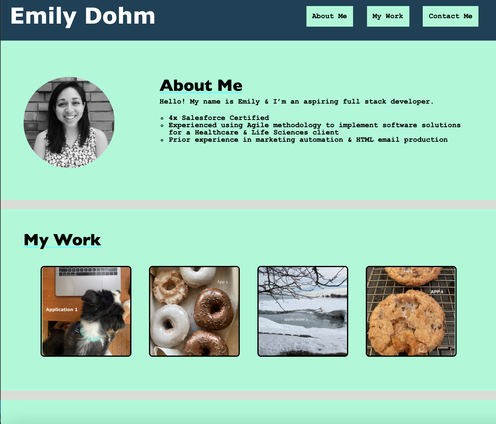

# bootcamp-homework-2
NU Coding Bootcamp Homework 2: Portfolio Project
<h1>Contents</h1>
<ol>
<li><a href="#repository">The Repository</a></li>
<li><a href="#portfolio-page">Portfolio Page</a></li>
</ol>

<h1 id="repository">The Repository</h1>
The <code>bootcamp-homework-2</code> repository contains HTML & CSS files for a professional portfolio.
<h1 id="portfolio-page">Portfolio Page</h1>
My professional portfolio can be found here: <a href="https://emilyalv.github.io/bootcamp-homework-2/">https://emilyalv.github.io/bootcamp-homework-2/</a>

This page was designed to have 3 sections: 
<ul>
<li>About Me: This section shares a few details about my professional background.</li>
<li>My Work: This section contains linked icons. These are currently placeholders for future applications that I will refer to in my portfolio.</li>
<li>Contact Me: This section contains my professional contact information.</li>
</ul>

The portfolio page is responsive for different screen sizes. 
